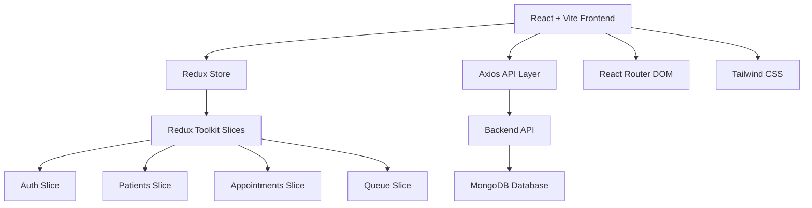
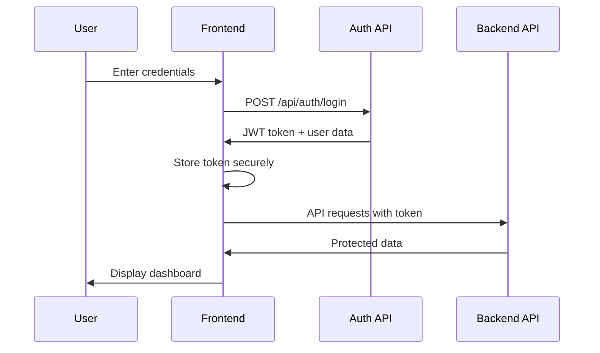

# Design Document

## Overview

The Clinic Front Desk System frontend is a React-based single-page application (SPA) built with Vite that provides an intuitive interface for clinic staff to manage daily operations. The application connects to an existing Node.js/Express backend API and uses Redux Toolkit for state management, Tailwind CSS for styling, Axios for API calls, and React Router DOM for navigation.

## Architecture

### High-Level Architecture



### Frontend Architecture Layers

1. **Presentation Layer**: React components styled with Tailwind CSS
2. **State Management**: Redux Toolkit with RTK Query for server state
3. **API Integration**: Axios for HTTP requests with interceptors
4. **Routing**: React Router DOM for navigation and protected routes
5. **Build Tool**: Vite for fast development and optimized builds
6. **Styling**: Tailwind CSS for utility-first responsive design

## Components and Interfaces

### Core Application Structure

```
src/
├── components/
│   ├── common/
│   │   ├── Layout.jsx
│   │   ├── Navbar.jsx
│   │   ├── Sidebar.jsx
│   │   ├── LoadingSpinner.jsx
│   │   └── ErrorMessage.jsx
│   ├── auth/
│   │   ├── LoginForm.jsx
│   │   └── ProtectedRoute.jsx
│   ├── dashboard/
│   │   ├── Dashboard.jsx
│   │   ├── StatsCard.jsx
│   │   └── QuickActions.jsx
│   ├── patients/
│   │   ├── PatientList.jsx
│   │   ├── PatientForm.jsx
│   │   ├── PatientCard.jsx
│   │   └── PatientDetails.jsx
│   ├── doctors/
│   │   ├── DoctorList.jsx
│   │   ├── DoctorCard.jsx
│   │   └── DoctorAvailability.jsx
│   ├── appointments/
│   │   ├── AppointmentList.jsx
│   │   ├── AppointmentForm.jsx
│   │   ├── AppointmentCard.jsx
│   │   └── CalendarView.jsx
│   └── queue/
│       ├── QueueManagement.jsx
│       ├── QueueItem.jsx
│       └── QueueStats.jsx
├── store/
│   ├── index.js
│   ├── slices/
│   │   ├── authSlice.js
│   │   ├── patientsSlice.js
│   │   ├── doctorsSlice.js
│   │   ├── appointmentsSlice.js
│   │   └── queueSlice.js
│   └── api/
│       ├── apiSlice.js
│       ├── authApi.js
│       ├── patientsApi.js
│       ├── doctorsApi.js
│       ├── appointmentsApi.js
│       └── queueApi.js
├── services/
│   ├── axios.js
│   └── storage.js
├── hooks/
│   ├── useAuth.js
│   └── useLocalStorage.js
├── utils/
│   ├── constants.js
│   ├── helpers.js
│   └── validators.js
├── pages/
│   ├── Login.jsx
│   ├── Dashboard.jsx
│   ├── Patients.jsx
│   ├── Doctors.jsx
│   ├── Appointments.jsx
│   └── Queue.jsx
└── styles/
    └── index.css
```

### Key Component Interfaces

#### Redux Store Structure
```javascript
interface RootState {
  auth: AuthState;
  patients: PatientsState;
  doctors: DoctorsState;
  appointments: AppointmentsState;
  queue: QueueState;
}

interface AuthState {
  user: User | null;
  token: string | null;
  isAuthenticated: boolean;
  isLoading: boolean;
  error: string | null;
}
```

#### RTK Query API Interface
```javascript
interface ApiEndpoints {
  // Auth endpoints
  login: (credentials: LoginCredentials) => Promise<AuthResponse>;
  logout: () => Promise<void>;
  
  // Patient endpoints
  getPatients: () => Promise<Patient[]>;
  createPatient: (patient: CreatePatientRequest) => Promise<Patient>;
  updatePatient: (id: string, patient: UpdatePatientRequest) => Promise<Patient>;
  deletePatient: (id: string) => Promise<void>;
}
```

#### Patient Management Interface
```javascript
interface Patient {
  _id: string;
  name: string;
  age: number;
  gender: 'Male' | 'Female' | 'Other';
  contact: string;
  address?: string;
  medicalHistory?: string;
  createdAt: Date;
  updatedAt: Date;
}
```

## Data Models

### Frontend Data Models (TypeScript Interfaces)

#### User Model
```javascript
interface User {
  _id: string;
  name: string;
  email: string;
  role: 'frontdesk' | 'admin';
  createdAt: Date;
}
```

#### Doctor Model
```javascript
interface Doctor {
  _id: string;
  name: string;
  specialization: string;
  gender: 'Male' | 'Female' | 'Other';
  location: string;
  availableSlots: string[];
  isActive: boolean;
  createdAt: Date;
  updatedAt: Date;
}
```

#### Appointment Model
```javascript
interface Appointment {
  _id: string;
  doctor: Doctor;
  patient: Patient;
  date: string;
  time: string;
  status: 'Booked' | 'Completed' | 'Canceled';
  createdAt: Date;
  updatedAt: Date;
}
```

#### Queue Model
```javascript
interface QueueItem {
  _id: string;
  patient: Patient;
  doctor: Doctor;
  queueNumber: number;
  status: 'Waiting' | 'With Doctor' | 'Completed';
  priority: 'Normal' | 'Urgent';
  createdAt: Date;
  updatedAt: Date;
}
```

### Redux State Management Structure

#### Redux Slices Structure
```javascript
// Auth Slice
interface AuthState {
  user: User | null;
  token: string | null;
  isAuthenticated: boolean;
  isLoading: boolean;
  error: string | null;
}

// Patients Slice
interface PatientsState {
  patients: Patient[];
  selectedPatient: Patient | null;
  isLoading: boolean;
  error: string | null;
}

// Appointments Slice
interface AppointmentsState {
  appointments: Appointment[];
  selectedDate: string;
  isLoading: boolean;
  error: string | null;
}

// Queue Slice
interface QueueState {
  queueItems: QueueItem[];
  currentDoctor: string | null;
  isLoading: boolean;
  error: string | null;
}
```

#### RTK Query Cache Management
```javascript
// API slice with automatic caching and invalidation
const apiSlice = createApi({
  reducerPath: 'api',
  baseQuery: fetchBaseQuery({
    baseUrl: '/api',
    prepareHeaders: (headers, { getState }) => {
      const token = getState().auth.token;
      if (token) {
        headers.set('authorization', `Bearer ${token}`);
      }
      return headers;
    },
  }),
  tagTypes: ['Patient', 'Doctor', 'Appointment', 'Queue'],
  endpoints: (builder) => ({
    // Endpoints with automatic cache invalidation
  }),
});
```

## Error Handling

### Error Handling Strategy

1. **API Error Interceptor**: Centralized error handling for HTTP requests
2. **Error Boundaries**: React error boundaries for component-level error catching
3. **User-Friendly Messages**: Convert technical errors to user-readable messages
4. **Retry Mechanisms**: Automatic retry for network failures
5. **Offline Support**: Basic offline detection and messaging

### Error Types and Handling

```javascript
interface ErrorHandler {
  // Network errors
  handleNetworkError: (error: NetworkError) => void;
  
  // Authentication errors
  handleAuthError: (error: AuthError) => void;
  
  // Validation errors
  handleValidationError: (error: ValidationError) => void;
  
  // Server errors
  handleServerError: (error: ServerError) => void;
}
```

### Error Display Components

- **Toast Notifications**: For temporary error messages
- **Inline Errors**: For form validation errors
- **Error Pages**: For critical application errors
- **Retry Buttons**: For recoverable errors

## Testing Strategy

### Testing Approach

1. **Unit Testing**: Individual component and utility function testing
2. **Integration Testing**: API integration and context provider testing
3. **End-to-End Testing**: Critical user flow testing
4. **Accessibility Testing**: WCAG compliance verification

### Testing Tools and Framework

- **Jest**: Unit and integration testing framework
- **React Testing Library**: Component testing utilities
- **MSW (Mock Service Worker)**: API mocking for tests
- **Cypress**: End-to-end testing framework
- **axe-core**: Accessibility testing

### Test Coverage Areas

#### Unit Tests
- Component rendering and props handling
- Utility functions and helpers
- Custom hooks functionality
- Form validation logic

#### Integration Tests
- API service integration
- Context provider functionality
- Route navigation and protection
- Form submission workflows

#### E2E Tests
- Complete user authentication flow
- Patient registration and management
- Appointment booking process
- Queue management operations

### Testing Structure

```
src/
├── __tests__/
│   ├── components/
│   ├── services/
│   ├── hooks/
│   └── utils/
├── __mocks__/
│   ├── api.js
│   └── localStorage.js
└── cypress/
    ├── integration/
    ├── fixtures/
    └── support/
```

## UI/UX Design Principles

### Design System with Tailwind CSS

1. **Tailwind Configuration**: Custom healthcare theme with medical colors
2. **Typography**: Tailwind typography plugin with custom font scales
3. **Spacing**: Tailwind's consistent spacing scale (4px base unit)
4. **Components**: Reusable Tailwind component classes and variants
5. **Responsive Design**: Tailwind's mobile-first responsive utilities

#### Tailwind Custom Configuration
```javascript
// tailwind.config.js
module.exports = {
  content: ['./src/**/*.{js,jsx,ts,tsx}'],
  theme: {
    extend: {
      colors: {
        primary: {
          50: '#f0f9ff',
          500: '#3b82f6',
          600: '#2563eb',
          700: '#1d4ed8',
        },
        medical: {
          50: '#f8fafc',
          100: '#f1f5f9',
          500: '#64748b',
          600: '#475569',
        },
        success: '#10b981',
        warning: '#f59e0b',
        error: '#ef4444',
      },
      fontFamily: {
        sans: ['Inter', 'system-ui', 'sans-serif'],
      },
    },
  },
  plugins: [
    require('@tailwindcss/forms'),
    require('@tailwindcss/typography'),
  ],
};
```

### Accessibility Features

- **Keyboard Navigation**: Full keyboard accessibility
- **Screen Reader Support**: Proper ARIA labels and roles
- **Color Contrast**: WCAG AA compliant color combinations
- **Focus Management**: Clear focus indicators and logical tab order
- **Alternative Text**: Descriptive alt text for images and icons

### User Experience Considerations

- **Loading States**: Clear loading indicators for all async operations
- **Empty States**: Helpful empty state messages with actions
- **Confirmation Dialogs**: Confirmation for destructive actions
- **Auto-save**: Automatic saving of form data where appropriate
- **Search and Filtering**: Quick search and filter capabilities

## Performance Optimization

### Optimization Strategies

1. **Vite Build Optimization**: Fast HMR and optimized production builds
2. **Code Splitting**: Route-based code splitting with React.lazy
3. **Redux Performance**: RTK Query automatic caching and normalization
4. **Tailwind Purging**: Automatic unused CSS removal in production
5. **Bundle Analysis**: Vite bundle analyzer for size monitoring

### Caching Strategy

- **RTK Query Caching**: Automatic API response caching with invalidation
- **Redux Persist**: Persist auth state and user preferences
- **Vite Static Assets**: Optimized static asset caching
- **Browser Caching**: Proper cache headers for production builds

## Security Considerations

### Frontend Security Measures

1. **JWT Token Management**: Secure token storage and automatic refresh
2. **Input Validation**: Client-side validation with server-side verification
3. **XSS Prevention**: Proper data sanitization and CSP headers
4. **Route Protection**: Authentication-based route access control
5. **Sensitive Data**: No sensitive data in localStorage or client-side code

### Authentication Flow



## API Integration

### API Integration with Axios and RTK Query

The frontend integrates with existing backend API endpoints using Axios as the base client and RTK Query for state management:

- **Authentication**: `/api/auth/*`
- **Patients**: `/api/patients/*`
- **Doctors**: `/api/doctors/*`
- **Appointments**: `/api/appointments/*`
- **Queue**: `/api/queue/*`

### Axios Configuration

```javascript
// services/axios.js
import axios from 'axios';
import { store } from '../store';
import { logout } from '../store/slices/authSlice';

const axiosInstance = axios.create({
  baseURL: 'http://localhost:8000/api',
  timeout: 10000,
});

// Request interceptor for auth token
axiosInstance.interceptors.request.use(
  (config) => {
    const token = store.getState().auth.token;
    if (token) {
      config.headers.Authorization = `Bearer ${token}`;
    }
    return config;
  },
  (error) => Promise.reject(error)
);

// Response interceptor for error handling
axiosInstance.interceptors.response.use(
  (response) => response,
  (error) => {
    if (error.response?.status === 401) {
      store.dispatch(logout());
    }
    return Promise.reject(error);
  }
);

export default axiosInstance;
```

### RTK Query Base Query

```javascript
// store/api/apiSlice.js
import { createApi, fetchBaseQuery } from '@reduxjs/toolkit/query/react';

export const apiSlice = createApi({
  reducerPath: 'api',
  baseQuery: fetchBaseQuery({
    baseUrl: 'http://localhost:8000/api',
    prepareHeaders: (headers, { getState }) => {
      const token = getState().auth.token;
      if (token) {
        headers.set('authorization', `Bearer ${token}`);
      }
      return headers;
    },
  }),
  tagTypes: ['Patient', 'Doctor', 'Appointment', 'Queue', 'User'],
  endpoints: () => ({}),
});
```

## Deployment and Build Configuration

### Build Configuration

- **Vite Configuration**: Optimized build settings for production
- **Environment Variables**: Separate configs for development/production
- **Asset Optimization**: Image compression and CSS minification
- **Bundle Splitting**: Vendor and app code separation

### Deployment Strategy

1. **Development**: Local development with hot reload
2. **Staging**: Preview deployment for testing
3. **Production**: Optimized build with CDN integration
4. **CI/CD**: Automated testing and deployment pipeline
##
 Technology Stack Summary

### Core Technologies
- **React 19**: Latest React with concurrent features
- **Vite**: Fast build tool and dev server
- **Tailwind CSS**: Utility-first CSS framework
- **Redux Toolkit**: Modern Redux with RTK Query
- **React Redux**: Official React bindings for Redux
- **Axios**: HTTP client for API requests
- **React Router DOM**: Client-side routing

### Development Dependencies
- **ESLint**: Code linting and formatting
- **PostCSS**: CSS processing for Tailwind
- **Autoprefixer**: CSS vendor prefixing

### Vite Configuration

```javascript
// vite.config.js
import { defineConfig } from 'vite';
import react from '@vitejs/plugin-react';

export default defineConfig({
  plugins: [react()],
  build: {
    outDir: 'dist',
    sourcemap: true,
    rollupOptions: {
      output: {
        manualChunks: {
          vendor: ['react', 'react-dom'],
          redux: ['@reduxjs/toolkit', 'react-redux'],
          router: ['react-router-dom'],
          ui: ['axios'],
        },
      },
    },
  },
  server: {
    port: 5173,
    proxy: {
      '/api': {
        target: 'http://localhost:8000',
        changeOrigin: true,
      },
    },
  },
});
```

### Package Dependencies

```json
{
  "dependencies": {
    "react": "^19.1.1",
    "react-dom": "^19.1.1",
    "react-router-dom": "^6.x",
    "@reduxjs/toolkit": "^2.x",
    "react-redux": "^9.x",
    "axios": "^1.x",
    "tailwindcss": "^3.x"
  },
  "devDependencies": {
    "@vitejs/plugin-react": "^5.x",
    "vite": "^6.x",
    "eslint": "^9.x",
    "postcss": "^8.x",
    "autoprefixer": "^10.x"
  }
}
```